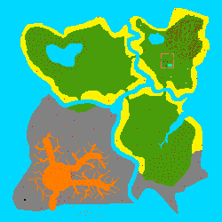

# Technical Documentation

## Introduction

This document provides an overview of the technical aspects of the project. It is intended for developers who are interested in contributing to the project or who want to understand the technical details of the project.

## The Tilemap

Above is the tilemap of the game. The game is divided into a grid of tiles. Each tile represents a different type of terrain. The player can move on the tiles and interact with them.

The tilemap is stored in a 2D array. Each element of the array represents a tile. The value of the element determines the type of terrain.

Here is the description of the different types of terrain:
| Value | Terrain | Color |
| --- | --- | --- |
| 0 | Grass | #4a9d0a |
| 1 | Water | #00d8ff |
| 2 | Sand | #fff200 |
| 3 | Rock | #828282 |
| 4 | Tree | #80430d |
| 5 | Firecamp | #1500ff |
| 6 | Workbench | #118056 |
| 7 | House | #00ff9f |
| 8 | Plantation | #f87e00 |
| 9 | Animal Enclosures | #7a00ff |
| 10 | Blackbox | #000000 |
| 11 | Shelter Walls | #ff6b6b |
| 12 | Animal Spawner | #ffffff |

## The Player

The player is represented by a sprite(16x16). The player can move on the tilemap and interact with the different types of terrain.

The player has the following attributes:
- Health: The player's health points. If the player's health points reach 0, the player dies.
- Hunger: The player's hunger points. If the player's hunger points reach 0, the player loses health points.
- Thirst: The player's thirst points. If the player's thirst points reach 0, the player loses health points.
- Inventory: The player's inventory. The player can collect resources and store them in the inventory.
- Quests: The player's quests. The player has to complete quests to progress in the game.
- Level: The player's level. The player's increases his level by completing quests.
- Position: The player's position on the tilemap.
- Direction: The player's direction. The player can move in four directions: up, down, left, right.

## The Interaction System

### Trees

The player can interact with trees to collect wood. To collect wood, the player has to press the space key when he is near a tree. The player can collect wood until his inventory is full.
A Tree give 5 woods and 2 fruits.
A Fruit give 3 hunger points out of 10.

### Water

The player can interact with water to drink water. Once the player drinks water, his thirst points increase.
An interaction with Water give 3 thirst points out of 10.
On the second island, the player can have a water bottle to store water.

### The Animals

When a player have a sword, he can kill animals to get meat. The player can interact with animals to kill them. Once the player kills an animal, he gets meat.
He need to cook the meat to avoid sickness.
A meat give 5 hunger points out of 10.
If the player doesn't cook the meat, he will lose 2 health points and gain only 2 hunger points.

### The Workbench

The player can interact with the workbench to craft tools. Once the player interacts with the workbench, he can choose a tool to craft. The player needs resources to craft tools. Once the player crafts a tool, it is added to his inventory.

We need to provide 10 woods to build the workbench.

To see the crafting system, see the [Crafting System](#crafting-system) section.

### The Firecamp

The player can interact with the firecamp to put some woods in it, the firecamp is full with 5 woods.
To light the firecamp, the player needs to interact with it with a fire starter.
Once the firecamp is active the player can cook meat on it.
A meat consume 1 wood.
When the firecamp don't have any wood, the firecamp is inactive and the fire goes out.

### The Shelter

The player can interact with the shelter to sleep. When the player sleeps, his health points, hunger points and thirst points are restored.

## The Crafting System

The player can craft tools at the workbench. To craft a tool, the player needs resources. The player can see the list of tools he can craft and the resources needed to craft them.

Here is the list of tools the player can craft:

| Level | Tool | Resources |
| --- | --- | --- |
| 1 | Wooden Pickaxe | 5 woods |
| 1 | Wooden Axe | 5 woods |
| 1 | Wooden Sword | 5 woods |
| 3 | Bridge to second island | 20 woods |
| 4 | Stone Pickaxe | 5 stones and 5 woods |
| 4 | Stone Axe | 5 stones and 5 woods |
| 4 | Stone Sword | 5 stones and 5 woods |
| 5 | Fire Starter | 2 stones |
| 5 | Firecamp | 10 woods |
| 7 | Shelter | 30 woods and 10 stones |

## The Quest System

The player has to complete quests to progress in the game. Each quest has a level and a list of objectives. The player has to complete the objectives to complete the quest.

Here is the list of quests the player has to complete, sorted by level:

### Level 1: The Beginner
- Collect 5 woods
- Collect 2 fruits

### Level 2: The Crafter
- Craft the workbench
- Drink water

### Level 3: The Lumberjack
- Craft a wooden axe
- Collect 20 woods
- Craft the bridge to the second island

### Level 4: The Stone Age
- Craft a wooden pickaxe
- Collect 10 stones

### Level 5: The Firestarter
- Craft a firecamp
- Feed the firecamp with 5 woods
- Craft a fire starter

### Level 6: The Hunter
- Craft a wooden sword
- Kill an animal
- Cook the meat

### Level 7: The Shelter Builder
- Craft the shelter
- Sleep in the shelter

## Architecture
